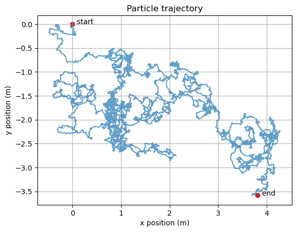

# Particle Motion Time Series Analysis

We use the simulator [TorusParticles](https://github.com/michaelhallam123/TorusParticles) to simulate particles moving freely on a two-dimensional torus, and study the motion of a large particle moving in a fluid of smaller particles.

Over a long period of time the particle's trajectory is unpredictable. However, over a short period of time there is some scope for predicting the particle's motion. We assess the performance of several models for predicting the particle's trajectory over a small time period.